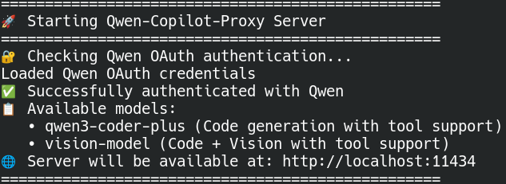

# Qwen-Copilot-Proxy



A robust proxy server that enables Qwen Code models to work with GitHub Copilot Chat by mimicking the Ollama API interface.

## Technical Overview

This proxy server provides API compatibility between GitHub Copilot Chat and Qwen Code models by implementing Ollama's API interface.

### Components

**Qwen Code**: An AI-powered command-line workflow tool optimized for Qwen3-Coder models, providing code understanding, editing, and workflow automation capabilities for developers. [GitHub Repository](https://github.com/QwenLM/qwen-code)

**GitHub Copilot Chat**: An AI peer programming assistant that provides conversational coding assistance within VS Code, supporting multiple model providers through standardized APIs. [GitHub Repository](https://github.com/microsoft/vscode-copilot-chat)

**Proxy Function**: The server translates Ollama API requests from Copilot Chat into Qwen's API format, handling authentication, model selection, and response streaming while maintaining full compatibility with both systems.

```
GitHub Copilot Chat ↔️ localhost:11434 (Ollama endpoint)
                              ↓
                    Qwen-Copilot-Proxy Server
                              ↓
                      Qwen API (OAuth2)
```

## Supported Models

- **`qwen3-coder-plus`** - Code generation model based on Qwen3. Compared to the previous version, it demonstrates improved robustness in downstream tasks and tool calling, along with enhanced code security. (version: qwen3-coder-plus-2025-09-23)

- **`vision-model`** - Vision-language understanding model in the Qwen3 series, comprehensively upgraded in areas such as visual coding, spatial perception, and multimodal reasoning. Supports ultra-long video understanding. **Note: Vision capabilities on the vision model are currently working flawlessly.** (version: qwen3-vl-plus-2025-09-23)

## Quick Start

### Prerequisites

1. **Qwen Account**: You need to install the Qwen-code CLI and create an account with the OAuth option to get access to Qwen-Code models. For installation instructions, see the [Qwen Code GitHub repository](https://github.com/QwenLM/qwen-code).
2. **Qwen OAuth Credentials**: Stored in `~/.qwen/oauth_creds.json`
3. **Python 3.8+**: Required to run the proxy server
4. **GitHub Copilot Chat Extension**: Required for VS Code integration

### Installation

1. **Create and activate a virtual environment (recommended):**
   ```bash
   python -m venv qwen-proxy-venv
   source qwen-proxy-venv/bin/activate  # On Windows: qwen-proxy-venv\Scripts\activate
   ```

2. **Install Python dependencies:**
   ```bash
   pip install -r requirements.txt
   ```

### Running the Proxy

1. **Start the proxy server:**
   ```bash
   python proxy_server.py
   ```

2. **The server will start on `http://localhost:11434`** (same port as Ollama - make sure Ollama is not running at the same time, or you'll get port conflicts)

3. **Configure GitHub Copilot Chat:**
   - Open VS Code GitHub Copilot Chat
   - Click the name of the model you're currently running to see the list of available models
   - Click 'Manage Models...'
   - A screen showing you the list of providers will appear, choose 'ollama'
   - Choose your preferred model:
     - **`qwen3-coder-plus`** for pure code generation
     - **`vision-model`** for code + vision tasks

## Features

### 🔧 Robust OAuth Authentication
- Automatic token refresh with 30-second buffer
- Comprehensive error handling for credential issues
- Secure credential storage and validation

### 🔄 Retry Logic & Error Recovery
- Automatic retries for network failures (up to 3 attempts)
- Intelligent token refresh on 401 errors
- Graceful degradation and detailed error reporting

### 📊 Enhanced Monitoring
- Health check endpoint at `/health`
- Detailed status reporting
- Real-time authentication status

### 🎯 Model Selection
- Both `qwen3-coder-plus` and `vision-model` available
- Proper capability reporting (tools, vision)
- Model-specific context window handling

## API Endpoints

### Ollama-Compatible Endpoints
- `GET /api/tags` - Returns list of available Qwen models in Ollama format
- `GET /api/list` - Model list endpoint (alias for /api/tags)
- `POST /api/show` - Retrieves detailed model information including capabilities (tools, vision support)
- `POST /v1/chat/completions` - OpenAI-compatible chat completions with streaming and non-streaming support

### Monitoring Endpoints
- `GET /` - Server status and available models
- `GET /health` - Health check with authentication status and model availability
- `GET /api/version` - Returns Ollama version 0.6.4 for compatibility verification

## Troubleshooting

### Common Issues

1. **"Failed to authenticate with Qwen" or "OAuth credentials file not found"**
   - Verify your OAuth credentials file exists at `~/.qwen/oauth_creds.json`
   - Ensure you've authenticated with Qwen using the Qwen CLI with OAuth
   - Check that the credentials file contains: `access_token`, `refresh_token`, `token_type`, `expiry_date`

2. **"Unsupported model" error**
   - Ensure you're using one of the supported models: `qwen3-coder-plus` or `vision-model`
   - Check the model name spelling exactly matches what's shown in Copilot Chat

3. **"Ollama provider not showing our models" or "Shows actual Ollama models"**
   - Make sure the proxy server is running and shows "✅ Qwen proxy is ready and authenticated"
   - Check that no other service is using port 11434 (stop actual Ollama if running)
   - Try accessing `http://localhost:11434/api/tags` in your browser - you should see both Qwen models

4. **Network errors or timeouts**
   - The proxy includes automatic retry logic for network failures
   - If issues persist, check your internet connection
   - Try restarting the proxy server

5. **Port 11434 already in use**
   ```bash
   # Check what's using the port
   lsof -i :11434  # Linux/macOS
   netstat -ano | findstr :11434  # Windows

   # Stop the conflicting service (usually Ollama)
   # Then start the proxy
   ```

### Debug Mode

For detailed logging, check the console output when starting the server. It shows:
- Authentication status
- Available models
- Any errors during startup or operation

### Health Check

Monitor the proxy status:
```bash
curl http://localhost:11434/health
```

Expected response:
```json
{
  "status": "healthy",
  "authenticated": true,
  "models_supported": ["qwen3-coder-plus", "vision-model"]
}
```

## Performance Tips

1. **Network Stability**: The proxy handles network issues gracefully, but a stable connection provides the best experience
2. **Token Management**: Tokens are automatically refreshed, but restarting the proxy occasionally ensures fresh authentication
3. **Model Selection**: Use `vision-model` only when you need vision capabilities for better performance since qwen3-coder-plus is better for coding.

## Version

**Current Version**: 1.1.0 (2025-11-28)

- Check version: `curl http://localhost:11434/version`
- View changelog: [CHANGELOG.md](CHANGELOG.md)
- Report issues: [GitHub Issues](https://github.com/edwardgj/Qwen-Copilot-Proxy/issues)

## License

This project is licensed under the MIT License - see the LICENSE file for details.
